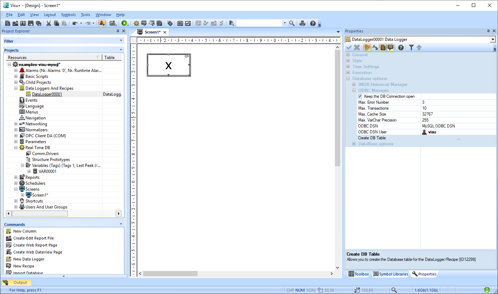

# Visu+ MySQL Server

## Prerequisites

-  Windows 10 x64
-  [Visu+ 2.50](https://www.phoenixcontact.com/online/portal/ru/?uri=pxc-oc-itemdetail:pid=2988544&&tab=5)
-  [MySQL Installer 8.0.17](https://dev.mysql.com/downloads/installer/)

## MySQL 

### Установка


**Внимание!** Даже на 64-битных системах Visu+ работает только с **32-битным ODBC коннектором**. Рекомендуется установка [ODBC коннектора версии 5.3](http://dev.mysql.com/downloads/connector/odbc/5.3.html).

### Конфигурация MySQL Server


-  **root password** - пароль для администрирования MySQL Server
-  **user account** - новый аккаунт для пользователя visu (user role **DB Designer**)

Аккаунты в данном примере

| Пользователь | Пароль |
| ------------ | ------ |
| root | rootpassword |
| visu | visupassword |


### Создание базы данных

MySQL Workbench позволяет администрировать сервер базы данных с помощью графического интерфейса.


Новая база данных создается кнопкой на панели управления, либо SQL командой
```sql
CREATE SCHEMA `visudb` DEFAULT CHARACTER SET utf8 ;
```


Не лишним будет установить ее базой данных по-умолчанию


## Visu+

### Создание пользователя для доступа к базе данных


### Historical Log Settings

**Historical Log** используется для хранения алармов (таблица **alarms**), системных сообщений (таблица **sysmsgs**) и сообщений драйверов (таблица **drivers**)


    

**Внимание!** На этом этапе начиная с версии Visu+ 2.50 возможна ошибка загрузки ODBC коннектора (system error  182). Рекомендуется установка [ODBC коннектора версии 5.3](http://dev.mysql.com/downloads/connector/odbc/5.3.html).


Нажатие на кнопку Create DB Table должно создать таблицы **alarms**, **sysmsgs** и **drivers** в базе данных.


### Datalogger settings

Тот же коннектор с именем **MySQL ODBC DSN** указываается для всех даталоггеров. Нажатие на кнопку Create DB Table должно создать таблицу с именем даталоггера в базе данных.




### Использование

#### Log Window

Позволяет отображать данные из таблиц **alarms**, **sysmsgs** и **drivers**


#### Datalogger Window

Позволяет отображать данные даталоггера в табличном виде


#### Trend

Позволяет отображать данные даталоггера в виде тренда


#### Запуск

